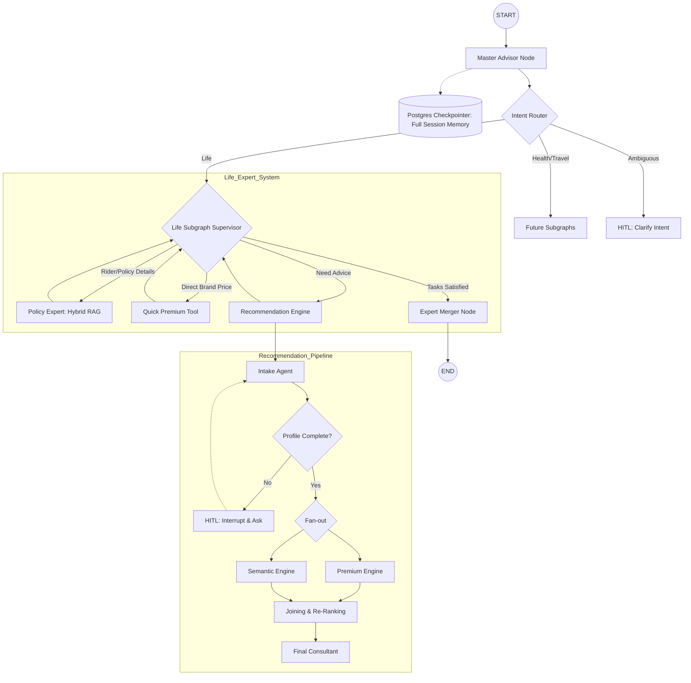

# Agentic Insurance Advisor (AIA)

**A Multi-Agent Orchestration System for Actuarial-Grade Insurance Advisory**

Agentic Insurance Advisor (AIA) is a stateful, multi-agent expert system built on **LangGraph** that transforms static insurance workflows into an intelligent, explainable decision engine.

Unlike traditional chatbots or form-based insurance tools, AIA reasons through complex financial products, performs deterministic premium calculations, researches policy clauses using hybrid retrieval, and maintains long-running conversational state with **Human-in-the-Loop (HITL)** support.

---
## High-Level Architecture

## Core Architecture: The Thinking Graph

AIA is built using a **Supervisor–Worker agentic architecture** on top of LangGraph.  
Instead of a linear chatbot flow, the system dynamically plans, executes, and re-evaluates actions across specialized agents to answer complex insurance queries correctly.

### Autonomous Intent Orchestration
A **Master Supervisor Node** acts as the control layer. It continuously evaluates:
- user intent
- current conversation state
- missing or incomplete information
- which tools are required to proceed

For multi-intent queries (e.g. *“What is the premium for HDFC Life and does it cover terminal illness?”*), the supervisor:
- invokes the premium engine for deterministic pricing
- routes to policy experts for clause-level details
- loops and aggregates results into a single coherent response

This enables **tool chaining and re-planning**, rather than rigid one-shot responses.

### Hybrid RAG for Policy Accuracy ((Vector Search + Keyword Search))
Policy and rider details are retrieved using **Hybrid RAG** to prevent hallucinations:
- **Vector search** captures semantic intent (e.g. family security, future income)
- **Keyword & metadata filters** restrict retrieval by plan and insurer
- **Namespace isolation** separates free benefits from paid add-ons

This guarantees precise, regulation-safe policy explanations.

### Parallel Recommendation Pipeline
When recommendations are required, the Life Insurance subgraph triggers a **parallel fan-out**:
- **Premium Engine** computes exact prices using PostgreSQL-backed actuarial logic
- **Semantic Engine** matches user goals with plans and riders
- **Consultant Reasoner** explains *why* a plan is suitable

All outputs are synthesized by a **Merger Node** into a clear, professional recommendation.

## Memory & State Management

AIA separates **execution memory** from **knowledge memory** to ensure correctness, explainability, and scalability in a regulated domain.

### Conversational & Decision State
- **PostgreSQL Checkpointer**
  - Persists full conversation and graph state
  - Enables session resumption across restarts
  - Supports Human-in-the-Loop (HITL) interruptions and resumes
  - Stores structured user facts (age, income, smoker status, intent)

### Knowledge Memory
- **Pinecone Vector Database**
  - Stores policy clauses, free benefits, paid add-ons, and insurer metadata
  - Uses multiple namespaces for strict plan and category isolation
  - Optimized for semantic retrieval, not numeric computation

This clear separation allows the system to remain **stateful and reliable**, while avoiding LLM hallucinations in pricing or eligibility decisions.

## Technology Stack

| Component | Technology | Purpose |
|---------|------------|---------|
| Orchestration | LangGraph | Cyclic execution, parallel fan-out, stateful agent control |
| API Layer |	FastAPI	| High-performance REST API to serve the graph, manage thread_id, and stream events |
| LLM Reasoning | Gemini 3 Flash / 2.5 Flash | High-context reasoning over policy and legal text |
| Infrastructure | Docker | Local containerized Postgres environment |
| Vector Database | Pinecone | Hybrid semantic retrieval of policy knowledge |
| Ranking Logic | Reciprocal Rank Fusion (RRF) | Algorithmic fusion of semantic and numeric scores for unbiased ranking |
| Relational Database | PostgreSQL | Source of truth for premiums, ratios and plan metadata |
| State Persistence | PostgreSQL Checkpointer | HITL support, resumable conversations, structured memory |
| Data Fetching |	Psycopg2 / RealDictCursor |	Reliable Python-Postgres connectivity with dictionary-mapped cursors |
| Data Validation | Pydantic | Strict schema enforcement for agentic outputs and profile parsing |
| Communication |	LangChain Core | Messages	Standardized message protocol for cross-node state updates |

## Project Structure

insurance_advisor/
├── core/
│   ├── persistence.py        # Postgres checkpointer & HITL setup
│   └── state.py              # Global InsuranceState definition
├── generate/
│   ├── gen_vector_store.py   # Pinecone ingestion & embeddings
│   ├── life_endpoint.py      # Insurer metadata & constants
│   └── premium.py            # Deterministic premium logic
├── graphs/
│   ├── life_subgraph/        # Domain-specific Life Insurance graph
│   │   ├── recommendation_tool/
│   │   │   ├── consultant.py     # Actuarial reasoning node
│   │   │   ├── premium_eng.py    # Parallel premium calculator
│   │   │   ├── semantic_eng.py   # Multi-query RAG engine
│   │   │   └── summary_ranker.py # RRF result aggregator
│   │   ├── main.py               # Life subgraph wiring
│   │   ├── merger_node.py        # Final response synthesizer
│   │   ├── policy_specific_tool.py # Hybrid RAG specialist
│   │   └── premium_tool.py       # Fast-path pricing utility
│   ├── master_advisor.py         # Global supervisor & intent router
│   └── master.py                 # Application entry point
├── docker-compose.yml            # Local Postgres setup
└── requirements.txt              # Python dependencies

## Key Capabilities

- **Deterministic Pricing**  
  Premiums are calculated using real actuarial logic from SQL-backed tables and fixed formulas, never approximated or hallucinated by an LLM.

- **Explainable Recommendations**  
  Every recommendation includes a clear rationale grounded in user goals, eligibility rules, policy clauses, and financial logic.

- **Trust & Reliability Metrics**  
  Automatically evaluates Claim Settlement Ratio (CSR) and Solvency Ratio to rank insurers by long-term reliability.

- **Human-in-the-Loop (HITL)**  
  Ambiguous inputs or missing critical data trigger controlled user clarification instead of unsafe assumptions.

- **Persistent Conversations**  
  Users can leave and resume sessions without losing extracted facts, progress, or decision context.

---

## Design Philosophy

AIA is **not a general-purpose chatbot**.

It is a **domain-specialized decision system** optimized for:

- correctness  
- compliance  
- explainability  
- predictable behavior  

The system answers insurance advisory questions exceptionally well and **gracefully deflects or reframes out-of-scope queries**.

---

## Intended Use Cases

- Life insurance plan recommendation  
- Rider selection and explanation  
- Deterministic premium estimation  
- Policy clause clarification  
- Insurer comparison and trust analysis  

---

## Summary

Agentic Insurance Advisor demonstrates how **agentic architectures, deterministic computation, and hybrid retrieval** can be combined to build reliable, production-grade financial advisory systems.

This project emphasizes **engineering rigor over chatbot novelty**, making it suitable for real-world deployment in regulated domains.
